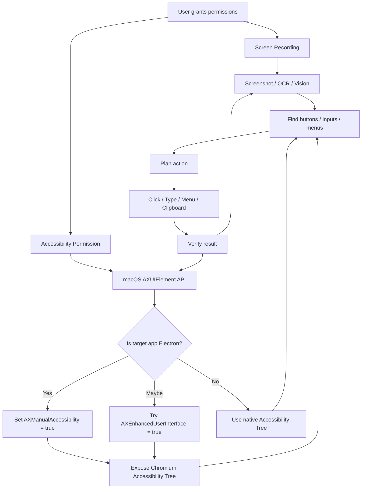

# Mac Computer Use 是怎么做的？以及「特殊比特位」是什么

> [!summary]
> Mac 上的 Computer Use 并不是单纯靠「截图 + 坐标点击」。更准确地说，它通常是由 **屏幕视觉理解 + macOS Accessibility API + 事件注入 + 权限控制** 组合而成。
>
> 文章里提到的「特殊比特位」，大概率指的是 Electron / Chromium 在 macOS Accessibility 体系里的一个布尔属性：`AXManualAccessibility`。把它设为 `true` 后，Electron 应用会暴露内部的 Accessibility Tree，从而让 Agent 能读到按钮、输入框、菜单等结构化 UI 元素。

---

## 结论

一句话总结：

```txt
Mac Computer Use = 截图视觉理解 + macOS Accessibility Tree + 鼠标/键盘事件注入 + 安全审批系统
```

而所谓「特殊比特位」大概率是：

```txt
AXManualAccessibility = true
```

它的作用是：

```txt
让 Electron / Chromium 应用主动打开 Accessibility Tree
→ Agent 可以读取结构化 UI 元素
→ 不再只能靠截图猜坐标
→ 后台操作、精确点击、输入框定位会更稳定
```

---

## Mac Computer Use 的基本链路

Mac 上的 Computer Use 通常依赖两类系统能力：

1. **Screen Recording**
   - 让 Agent 看到屏幕内容；
   - 可以做截图、视觉识别、OCR、坐标定位。

2. **Accessibility**
   - 让 Agent 读取窗口、按钮、输入框、菜单等 UI 结构；
   - 也可以发起点击、键盘输入、窗口切换等操作。

所以它不是一个单点技术，而是一条完整链路：

```txt
视觉层：截图 / OCR / 图像理解
    ↓
结构层：macOS Accessibility Tree / AXUIElement
    ↓
动作层：点击、键盘输入、菜单操作、窗口切换
    ↓
安全层：app allowlist、审批、敏感操作拦截
```

---

## 为什么不是纯截图点击？

纯截图点击的模式类似：

```txt
“这里好像有个按钮，点坐标 x=430 y=680”
```

这种方式有几个明显问题：

- 窗口被遮挡后，截图不完整；
- 多显示器、多 Space 下坐标容易错；
- App 缩放、窗口大小变化后，坐标不稳定；
- 对 Electron 这类 Web UI 应用，很多控件没有原生语义；
- 只靠视觉很难判断哪个元素是按钮、输入框、菜单项。

如果能读取 Accessibility Tree，Agent 的理解会变成：

```txt
“这是一个 AXButton，标题是播放，位置是 xxx，执行 click action”
```

这就稳定很多。

---

## macOS Accessibility Tree 是什么？

可以把它理解为 macOS 给辅助功能工具提供的一棵 UI 结构树。

类似 DOM Tree：

```txt
Window
├── Toolbar
│   ├── Button: 返回
│   ├── Button: 播放
│   └── SearchField: 搜索
├── Sidebar
│   ├── ListItem: 推荐
│   └── ListItem: 我的音乐
└── MainContent
    ├── Button: 收藏
    ├── Button: 下载
    └── TextField: 评论输入框
```

通过 Accessibility API，外部工具可以知道：

- 当前有哪些窗口；
- 每个窗口里有哪些控件；
- 控件的位置和大小；
- 控件的 role，例如 button、text field、menu item；
- 控件的 label、value、state；
- 控件是否可以点击、聚焦、输入。

这就是 Computer Use 能「理解 GUI」的基础。

---

## Electron 为什么比较特殊？

Electron 应用本质是：

```txt
Chromium + Node.js + Native Shell
```

很多按钮、输入框、列表、菜单，其实都是 HTML / CSS / JavaScript 渲染出来的。

对 macOS 来说，如果 Electron 不主动暴露 Accessibility Tree，外部工具可能只能看到：

```txt
Window
└── WebArea
```

而不是：

```txt
Window
└── WebArea
    ├── Button: 播放
    ├── Input: 搜索
    ├── ListItem: 歌曲 A
    └── Button: 下载
```

所以 Electron App 经常需要额外打开 Accessibility 支持。

---

## 「特殊比特位」：AXManualAccessibility

Electron 官方文档里提到，macOS 上第三方辅助技术可以通过设置 `AXManualAccessibility` attribute，手动打开 Electron 应用的 accessibility features。

Objective-C 伪代码如下：

```objc
CFStringRef kAXManualAccessibility = CFSTR("AXManualAccessibility");

AXUIElementRef appRef = AXUIElementCreateApplication(app.processIdentifier);
AXUIElementSetAttributeValue(appRef, kAXManualAccessibility, kCFBooleanTrue);
```

Swift 版本类似：

```swift
let axApp = AXUIElementCreateApplication(pid)

AXUIElementSetAttributeValue(
  axApp,
  "AXManualAccessibility" as CFString,
  true as CFTypeRef
)
```

这里的关键是：

```txt
AXManualAccessibility = true
```

它不是真的某个二进制文件里的 magic bit，而是 macOS Accessibility API 里的一个布尔 attribute。

更准确地说，它是：

```txt
给目标 Electron 进程设置的一个 Accessibility 属性开关
```

效果是：

```txt
请求这个 Electron App 手动启用 Chromium Accessibility Tree
```

---

## 为什么它对 Computer Use 很重要？

没有它时：

```txt
Agent 只能看到截图
→ 通过视觉猜哪里是按钮
→ 根据坐标点击
→ 容易受遮挡、缩放、布局变化影响
```

有了它后：

```txt
Electron App 暴露 Accessibility Tree
→ Agent 读取按钮、输入框、菜单等结构化元素
→ 可以基于元素 role / label / bounds 操作
→ 点击和输入更稳定
```

举个例子。

没有 Accessibility Tree：

```txt
点击屏幕上疑似“播放”的图标坐标
```

有 Accessibility Tree：

```txt
查找 role = AXButton 且 title = 播放 的元素
调用 AXPress 或发送点击事件
```

这是两个完全不同的稳定性级别。

---

## AXManualAccessibility 和 AXEnhancedUserInterface 的关系

除了 `AXManualAccessibility`，还有一个相关属性：

```txt
AXEnhancedUserInterface
```

可以粗略理解为：

| 属性 | 作用 |
|---|---|
| `AXManualAccessibility` | 更偏 Electron / Chromium 手动开启 Accessibility Tree |
| `AXEnhancedUserInterface` | 更偏告诉 App：当前有增强辅助交互需求，请暴露更多 UI 信息 |

一些工具可能会同时尝试设置这两个属性，因为不同 App 或不同 Chromium / Electron 版本的行为可能不完全一样。

---

## 这和「后台操控」的关系

后台操控不只是「能不能点」，更关键是：

```txt
能不能知道要点哪里
```

如果目标 App 在后台、被遮挡、最小化，纯视觉方案会遇到很多问题：

```txt
窗口不可见 → 截图看不到
被遮挡 → 坐标不可靠
多 Space → 屏幕坐标变复杂
Electron 内部控件不可见 → 无语义结构
点击后抢焦点 → 打断用户当前工作
```

`AXManualAccessibility` 解决的是其中一环：

```txt
让 Electron App 暴露 UI 结构
```

再结合其他能力：

```txt
后台窗口发现
+ Accessibility Tree 读取
+ 坐标映射
+ background click
+ 键盘事件派发
+ OCR fallback
+ 安全审批
```

就可以做到更稳定的 Mac Computer Use。

---

## 可能的完整实现模型

一个比较合理的 Mac Computer Use 实现模型如下：

```txt
1. 获取用户授权
   - Screen Recording
   - Accessibility

2. 枚举窗口和目标 App
   - 找到目标进程 pid
   - 找到目标窗口
   - 获取窗口 bounds、Space、显示器信息

3. 对 Electron / Chromium App 做增强
   - AXUIElementCreateApplication(pid)
   - 设置 AXManualAccessibility = true
   - 必要时设置 AXEnhancedUserInterface = true

4. 读取 UI 结构
   - AXChildren
   - AXRole
   - AXTitle
   - AXValue
   - AXFrame
   - AXActions

5. 结合视觉层补足
   - 截图
   - OCR
   - 图像识别
   - 坐标转换

6. 规划操作
   - 找按钮
   - 找输入框
   - 找菜单项
   - 判断是否需要用户审批

7. 执行动作
   - AXPress
   - 鼠标点击
   - 键盘输入
   - 粘贴文本
   - 菜单操作

8. 反馈校验
   - 再次截图
   - 再读 Accessibility Tree
   - 判断操作是否成功
```

---

## 和前端/浏览器的类比

如果用前端视角理解：

```txt
截图视觉层 ≈ 看网页截图
Accessibility Tree ≈ 看语义化 DOM / ARIA Tree
AXManualAccessibility ≈ 强制 Chromium 把内部 ARIA Tree 暴露给系统
Computer Use Agent ≈ 一个可以读 UI Tree 并执行事件的自动化用户
```

也可以类比测试工具：

```txt
纯截图点击 ≈ Playwright 用坐标 click
Accessibility Tree 操作 ≈ Playwright getByRole('button', { name: '播放' }).click()
```

后者显然更稳定。

---

## Mermaid 总览图



---

## 关键 takeaway

> [!important]
> `AXManualAccessibility` 是理解这件事的关键。
>
> 它让 Electron / Chromium 应用从「一块不可理解的 WebView」变成「一棵可以被系统辅助功能读取的 UI Tree」。

所以，这条 X 里提到的「特殊比特位」可以理解为：

```txt
一个打开 Electron Accessibility Tree 的隐藏开关
```

它和 Mac Computer Use 的关系是：

```txt
没有它：Agent 更多依赖截图和坐标，容易不稳定
有了它：Agent 可以读取结构化 UI，操作 Electron App 更像操作原生 App
```

最终效果就是：

```txt
更稳定地识别按钮
更稳定地定位输入框
更稳定地执行后台点击
更少打断用户当前操作
更适合控制网易云、飞书、Slack、Notion、VS Code 等 Electron / Chromium App
```

---

## 延伸关键词

- [[macOS Accessibility]]
- [[AXUIElement]]
- [[AXManualAccessibility]]
- [[AXEnhancedUserInterface]]
- [[Electron]]
- [[Chromium Accessibility Tree]]
- [[Computer Use]]
- [[GUI Agent]]
- [[Background Click]]
- [[Screen Recording Permission]]
- [[Accessibility Permission]]

---

## 参考资料

- OpenAI Codex Computer Use 文档
- Electron Accessibility 文档
- Electron issue: Accessibility support discussions
- Alma release notes
- Hammerspoon / Electron Accessibility 相关实践文章
