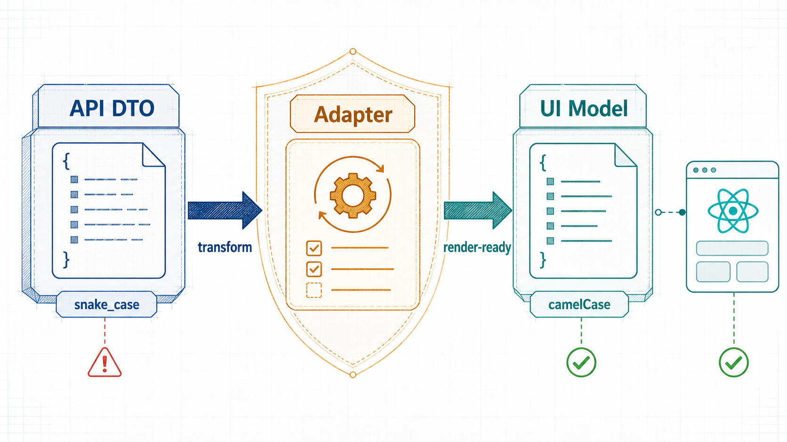
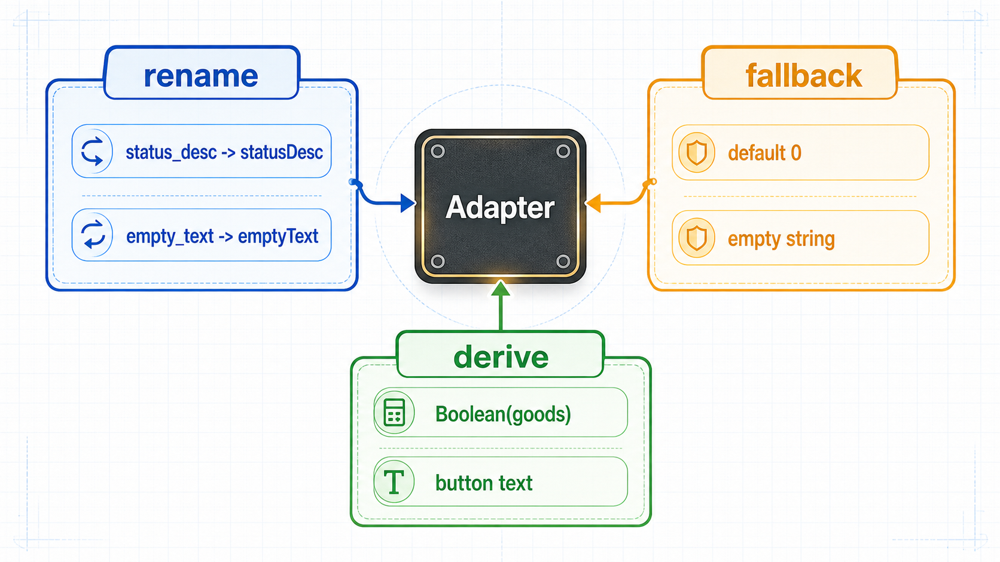
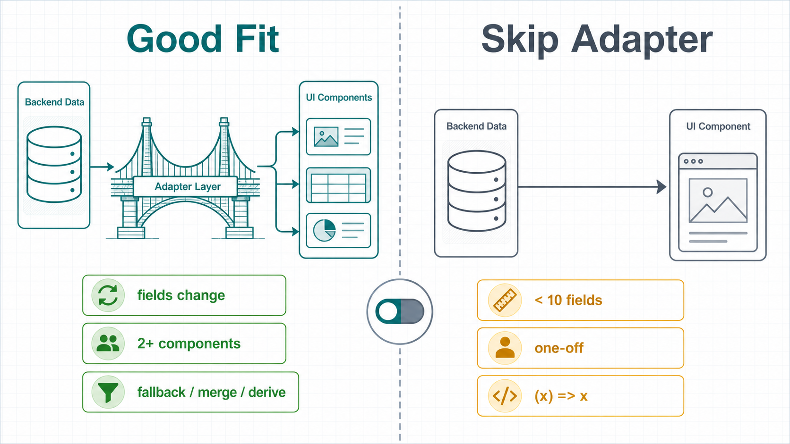

> [!info] 原文
> 主题是接口类型分层在 React/RN 项目里的落地方式。本笔记 = 原文整理 + 相关模式扩展研究。


![[Pasted image 20260516115125.png]]

![[Pasted image 20260516115147.png]]


## 核心论点

后端怎么传是一回事，页面怎么用是另一回事。==中间用 adapter 做转换，把变化控制在一个明确边界里。==

## 一条数据链路

```
API DTO  →  Adapter  →  UI Model
（IDL 原貌） （转换+兜底） （组件消费）
```

| 层 | 回答的问题 | 形态 |
| -- | -- | -- |
| **API DTO** | 后端返回了什么 | 字段保持 `snake_case`，可选字段按 IDL 标注，service / adapter 使用 |
| **Adapter** | 后端数据如何变成页面数据 | 字段改名、空值兜底、多字段合并、结构调整全部集中在这里 |
| **UI Model** | 组件需要什么 | 字段 `camelCase`，结构贴近组件，减少页面里的空值判断 |



## 三层分别负责什么

**API DTO ——描述传输协议**
回答"后端返回了什么"。==不要为了组件方便随意改字段名==，否则抓包、IDL、代码三者会对不上。

**Adapter ——描述转换规则**
回答"后端数据如何变成页面数据"。所有兜底、重命名、结构调整都应该集中在这里。

**UI Model ——描述页面需求**
回答"组件需要什么"。组件不需要理解后端协议细节，只消费适合渲染的数据。

## 以 distribution_area 为例

API DTO（`types/api/distribution-info/distribution-area`）：

```typescript
export type TDistributionArea = {
  status: number
  status_desc: string
  goods?: TGoods
  button?: TDistributionButton
  empty_text?: string
}
```

Adapter（`adapters/distribution-info.ts`）：

```typescript
export function adaptDistributionArea(
  dto?: TDistributionArea,
): TDistributionAreaView {
  return {
    status: dto?.status ?? 0,
    statusDesc: dto?.status_desc || '',
    emptyText: dto?.empty_text || '',
    canShowGoods: Boolean(dto?.goods),
    buttonText: dto?.button?.text || '',
  }
}
```

UI Model（`types/ui`）：

```typescript
export type TDistributionAreaView = {
  status: number
  statusDesc: string
  emptyText: string
  canShowGoods: boolean
  buttonText: string
}
```

注意 adapter 做了三件事：

1. **重命名**（`status_desc` → `statusDesc`，`empty_text` → `emptyText`）
2. **兜底**（`?? 0`、`|| ''`，让 UI Model 的字段可以是非 nullable）
3. **派生计算**（`canShowGoods: Boolean(dto?.goods)`、`buttonText: dto?.button?.text || ''`，把"组件渲染时需要什么"前置到 adapter 里完成，组件直接消费布尔/字符串而不是 nested optional 对象）



## 推荐目录结构

**接口协议**：按接口或业务域聚合，子模块按响应字段拆分。

```
types/api/distribution-info/distribution-area/index.ts
types/api/distribution-info/distribution-data-area/index.ts
```

**页面模型**：只放组件真正消费的类型，不和后端协议混在一起。

```
types/ui/index.ts
adapters/distribution-info.ts
```

## 判断规则

> [!warning] Checklist
> - 字段来自后端 IDL → 放进 `types/api`，保持原始命名
> - 字段是页面为了展示加工出来的 → 放进 `types/ui`
> - 出现 `snake_case` 到 `camelCase`、空值兜底、多字段合并 → 写进 adapter
> - **组件里如果反复写 `?.`、`|| ''`、字段映射** → 说明 adapter 边界还不够清楚，应该把这些下沉到 adapter

---

# 扩展研究：相关模式与上下文

原文这套"DTO / Adapter / View Model"分层在前端工程界有非常广泛的对应。把它放进更大的图谱里看，可以判断它在什么场景下值得落地、什么场景下属于过度设计。

## 1. 背后的设计原则：Anti-Corruption Layer

**Anti-Corruption Layer**（ACL）来自 Eric Evans 的 DDD（Domain-Driven Design）。原意是在两个有不同模型的子系统之间放一层翻译，==防止外部模型"污染"内部模型==。

> 当你的 domain model 必须和一个不归你控的外部 model 协作时（遗留系统、第三方 API、不同上下文的微服务），用 ACL 把外部 model 翻译成你自己的语言，避免它的概念渗透进你的 domain。

前端这个 adapter 层就是 ACL 在客户端的具体化：

- 外部 model = 后端 IDL DTO（不归前端控制，可能因为 IDL 格式、跨端兼容、历史包袱长得很难看）
- 内部 model = UI Model（前端自己的"组件域语言"）
- ACL = adapter 函数

==没有 ACL 的代价是"概念渗透"==：组件里到处出现 `data?.distribution_area?.status_desc ?? ''` 这种知道太多后端细节的代码，后端字段一改，前端要改很多处。

## 2. 经典对应：MVVM 的 ViewModel

UI Model 这一层在 GUI 架构里早有名字——**ViewModel**（MVVM 模式中的 VM）。

| MVVM | 本文方案 |
| -- | -- |
| Model | API DTO（再加一层后端 domain） |
| ViewModel | UI Model + Adapter |
| View | React/RN 组件 |

ViewModel 的核心定义就是"为 View 量身定制的、可直接绑定的数据结构"。React 社区因为 hooks 把 view 与 logic 拉得太近，反而很多项目省略了 ViewModel 这一层，一切都塞进组件 + custom hooks。原文的方案本质上是==在 React 生态里把 ViewModel 这一层重新显式画出来==。

## 3. 类似抽象：Backend-for-Frontend (BFF)

> [!compare] BFF vs 前端 Adapter
> - **BFF** 是后端层的 adapter，针对每种客户端（Web / iOS / Android）跑一个专属服务，把通用 API 聚合裁剪成客户端专用响应
> - **前端 Adapter** 是客户端内的 adapter，运行在浏览器/RN 里
>
> 两者解决同一个问题（后端通用协议 vs 客户端特定需求），只是边界不同。==有了 BFF 后，前端 adapter 层可以瘦很多==——但完全省掉它仍然有风险，因为 BFF 接口同样可能因为业务变化而变形。

## 4. 现代替代品：Schema 校验库做 Adapter

近几年 [Zod](https://zod.dev) / [Valibot](https://valibot.dev) / [io-ts](https://gcanti.github.io/io-ts/) 的流行让 adapter 这一层有了更"声明式"的写法。本质上 schema 库可以**同时做三件事**：

- 类型定义（取代手写的 `TDistributionArea`）
- 运行时校验（确保接口真的符合 IDL，IDL 漂移时早早抛错）
- 转换（`.transform()` 链式做字段重命名、兜底、派生）

```typescript
import { z } from 'zod'

const DistributionAreaSchema = z.object({
  status: z.number().default(0),
  status_desc: z.string().default(''),
  goods: z.unknown().optional(),
  button: z.object({ text: z.string().optional() }).optional(),
  empty_text: z.string().default(''),
}).transform((dto) => ({
  status: dto.status,
  statusDesc: dto.status_desc,
  emptyText: dto.empty_text,
  canShowGoods: Boolean(dto.goods),
  buttonText: dto.button?.text ?? '',
}))

export type TDistributionAreaView = z.infer<typeof DistributionAreaSchema>
```

==trade-off==：schema 库带来运行时开销 + bundle size，但换来"接口异常立刻报错"和"adapter 与 schema 同源"。在小红书这种 IDL 工具链很重的环境里，IDL 已经是 single source of truth，schema 库的"运行时校验"价值会被稀释，**手写 adapter 反而更轻**。

## 5. 数据请求库内置的 select

[TanStack Query](https://tanstack.com/query) 和 [SWR](https://swr.vercel.app/) 都提供了 `select` / 派生 selector 机制：

```typescript
const { data } = useQuery({
  queryKey: ['distribution', id],
  queryFn: () => fetchDistribution(id),
  select: adaptDistributionArea,  // ← adapter 直接挂在这里
})
```

好处是**缓存层就完成了 DTO → UI Model 的转换**，组件拿到的永远是 UI Model，不可能误用 DTO。原文的 adapter 函数可以无缝接到这种 hook 里，==分层是不是显式画出来 vs adapter 挂在哪一层执行，是两个独立的设计决策==。

## 6. GraphQL / IDL 直接共享类型的反例

如果团队用 GraphQL + Apollo Codegen，或者 IDL 直接生成 TypeScript 类型并且字段命名风格跟前端一致（驼峰），那 adapter 层的存在感会大幅下降——很多人会跳过这一层，组件直接消费生成的 type。

==但跳过的代价是：==

- 后端字段改名 = 整个组件树都要跟着改
- 后端把扁平字段变嵌套 = 同上
- 多接口拼装的页面无法在 adapter 层统一聚合

所以**就算 IDL 已经友好**，对页面级聚合数据仍然推荐写一个轻量 view-model adapter。

## 7. 何时不要这套分层

> [!example] 过度设计的信号
> - 接口字段总数 < 10、UI Model 与 DTO 几乎一一对应、没有兜底逻辑 → adapter 退化成 `(x) => x`，徒增层数
> - 一次性页面（活动页、临时落地页）→ 维护期短，分层成本回收不了
> - Prototype / POC → 直接用 DTO 更快

判断标准：==这个页面会不会经历 ≥3 次后端字段调整？会不会有 ≥2 个组件复用同一份数据？== 如果都不会，可能不需要 adapter 这一层。



## 8. 与"Humble Object / Presentation Model"的关系

Martin Fowler 的 [Presentation Model](https://martinfowler.com/eaaDev/PresentationModel.html) 早在 2004 年就提出了类似想法：把所有"为展示而做的状态加工"从 view 里抽到一个独立对象，view 退化成对 presentation model 的薄渲染。Humble Object 模式更进一步——==让 view 尽量"愚蠢"==，所有逻辑放在易测试的对象里。

本文的 UI Model + Adapter 组合是 Presentation Model 在 React/TS 项目里的轻量实现。

## 9. 落地建议（综合）

1. **先有 adapter，后有 UI Model 类型**：写 adapter 时类型自然冒出来，不要先空想 UI Model 结构
2. **adapter 必须 pure**：不依赖 react state、不发请求、不读全局变量，纯函数，方便单测
3. **组件 props 直接吃 UI Model 类型**：不要让组件再 import DTO 类型
4. **adapter 与 service 同目录**：`services/distribution-info.ts` 和 `adapters/distribution-info.ts` 平级，方便对照
5. **测试只测 adapter**：组件测试用 mock UI Model，adapter 测试覆盖兜底和边界——==测试金字塔的尖在 adapter 这一层==
6. **多接口聚合**：页面级 adapter 可以接收多个 DTO，输出一个聚合 UI Model，这是 BFF 缺位时的兜底方案

## 参考链接

- [Anti-Corruption Layer pattern (Microsoft Learn)](https://learn.microsoft.com/en-us/azure/architecture/patterns/anti-corruption-layer)
- [Presentation Model — Martin Fowler](https://martinfowler.com/eaaDev/PresentationModel.html)
- [BFF pattern — Sam Newman](https://samnewman.io/patterns/architectural/bff/)
- [Zod transform docs](https://zod.dev/?id=transform)
- [TanStack Query — select option](https://tanstack.com/query/latest/docs/framework/react/guides/render-optimizations#select)
