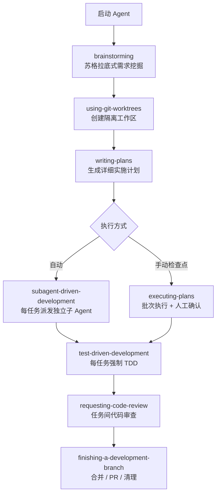

# Superpowers — AI 编码工作流框架

> [!abstract] 概览
> Superpowers 是一套为 AI 编码 Agent 设计的完整软件开发工作流，基于可组合的「Skills（技能模块）」构建。它让 Agent 在动手写代码之前先**思考、澄清、规划**，然后通过 Subagent 驱动的方式自主执行数小时而不偏离计划。

- **作者**：Jesse Vincent（[@obra](https://github.com/obra)）
- **仓库**：[github.com/obra/superpowers](https://github.com/obra/superpowers)
- **许可证**：MIT

---

## 核心理念

| 原则 | 说明 |
|------|------|
| **测试驱动开发（TDD）** | 永远先写测试，RED → GREEN → REFACTOR |
| **系统化优于临时性** | 用流程代替猜测 |
| **降低复杂度** | 简洁是第一目标（YAGNI + DRY） |
| **证据优于断言** | 声称成功前先验证 |

---

## 工作原理

Superpowers 在你启动 Agent 的那一刻就开始生效。

1. Agent 检测到你要做某件事时，**不会立即开始写代码**
2. 而是退一步，通过苏格拉底式提问**挖掘你真正的需求**
3. 把 Spec 整理成易于消化的小块展示给你确认
4. 生成足够详细的**实施计划**（细到每个任务 2–5 分钟）
5. 启动 **Subagent 驱动开发**，逐任务审查推进
6. 全程无需干预，Agent 可自主工作数小时

---

## 完整工作流



---

## Skills 库

### 测试
| Skill | 功能 |
|-------|------|
| `test-driven-development` | RED-GREEN-REFACTOR 循环，包含反模式参考 |

### 调试
| Skill | 功能 |
|-------|------|
| `systematic-debugging` | 四阶段根因分析流程 |
| `verification-before-completion` | 确认已真正修复，而不只是表面通过 |

### 协作 & 规划
| Skill | 功能 |
|-------|------|
| `brainstorming` | 苏格拉底式需求精炼 |
| `writing-plans` | 生成详细实施计划 |
| `executing-plans` | 批次执行 + 人工检查点 |
| `dispatching-parallel-agents` | 并发 Subagent 工作流 |
| `subagent-driven-development` | 快速迭代 + 两阶段审查 |
| `using-git-worktrees` | 并行开发分支管理 |
| `requesting-code-review` | 提交前审查清单 |
| `receiving-code-review` | 处理审查反馈 |
| `finishing-a-development-branch` | 合并 / PR 决策工作流 |

### Meta
| Skill | 功能 |
|-------|------|
| `writing-skills` | 创建新 Skill 的最佳实践指南 |
| `using-superpowers` | 技能系统介绍（首次使用必读） |

---

## 安装方式

> [!tip] 推荐方式：Claude Code 官方插件市场
> Superpowers 已上架 [Claude 官方插件市场](https://claude.com/plugins/superpowers)

### Claude Code（官方市场）
```
/plugin install superpowers@claude-plugins-official
```

### Claude Code（第三方市场）
```
/plugin marketplace add obra/superpowers-marketplace
/plugin install superpowers@superpowers-marketplace
```

### Cursor
```
/add-plugin superpowers
```
或在插件市场搜索 "superpowers"

### Gemini CLI
```bash
gemini extensions install https://github.com/obra/superpowers
# 更新
gemini extensions update superpowers
```

### Codex / OpenCode
告诉 Agent：
```
Fetch and follow instructions from https://raw.githubusercontent.com/obra/superpowers/refs/heads/main/.codex/INSTALL.md
```

### 验证安装
新开一个会话，说「帮我规划这个功能」或「我们来 debug 这个问题」，Agent 应该会自动触发对应的 Skill。

---

## 更新
```
/plugin update superpowers
```
Skills 随插件自动更新。

---

## 相关链接

- 📖 官方博客：[Superpowers for Claude Code](https://blog.fsck.com/2025/10/09/superpowers/)
- 🐛 Issues：[github.com/obra/superpowers/issues](https://github.com/obra/superpowers/issues)
- 🛒 插件市场：[github.com/obra/superpowers-marketplace](https://github.com/obra/superpowers-marketplace)
- 💸 赞助作者：[github.com/sponsors/obra](https://github.com/sponsors/obra)

---

## 相关笔记

- [[😈Magic/ai-coding/claude-code/Claude Code Memory 机制详解]]
